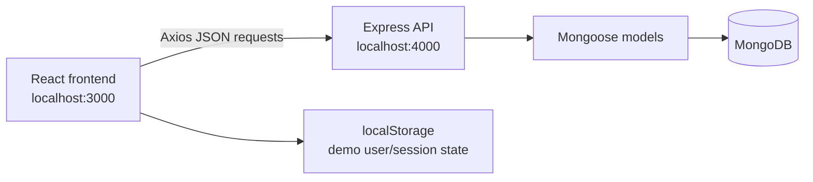
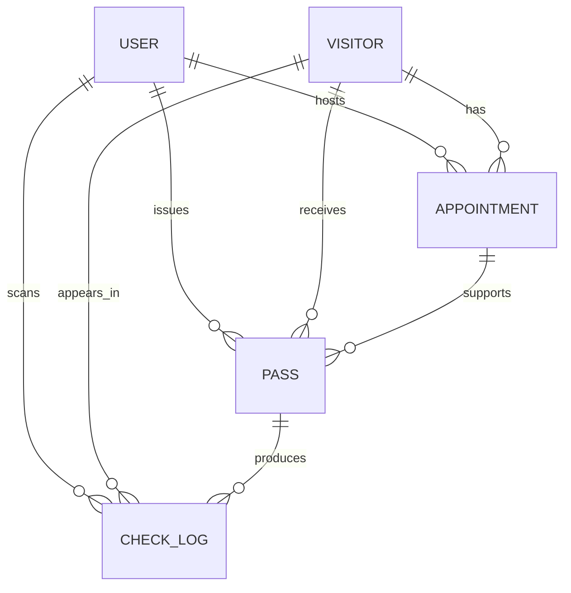

# Visitor Pass Management System

A MERN-based visitor pass management application for registering visitors, scheduling appointments, issuing passes, and recording check-in/check-out activity. The repository contains a React frontend and an Express/Mongoose backend backed by MongoDB.

> **Implementation note:** This README documents the code currently present in the repository. Some data and access-control behavior is still demo-oriented; those limitations are called out explicitly below.

## 📌 Overview

The system provides a browser-based interface for managing the core records involved in visitor access:

- Users with `admin`, `security`, or `employee` roles
- Visitor registration
- Host-linked appointments
- Appointment approval/rejection
- Visitor passes linked to appointments
- Check-in/check-out logs linked to visitors, passes, and users

The frontend communicates with the backend through Axios using `http://localhost:4000/api` as its base URL. The backend exposes REST endpoints and persists records in MongoDB through Mongoose.

## 🎯 Objectives

Based on the current implementation, the project aims to:

- Centralize visitor registration and visitor information.
- Associate visitors with employees/hosts through appointments.
- Track appointment status from pending through approval or rejection.
- Issue and list passes connected to visitors and appointments.
- Record check-in and check-out actions.
- Provide role-based navigation in the frontend.
- Give administrators a basic user-management interface.

## ✨ Features

### Implemented

- React single-page application with routes for login, dashboard, users, visitors, appointments, passes, check logs, and profile.
- Demo login form that stores a user object in browser `localStorage`.
- Protected frontend routes that redirect to `/login` when no `localStorage.user` value exists.
- Role-dependent sidebar navigation:
  - Admin: dashboard, visitors, appointments, passes, check logs, users, and profile.
  - Security: dashboard, visitors, passes, check logs, and profile.
  - Employee: dashboard, appointments, and profile.
- User creation, listing, update, and deletion API operations.
- Visitor creation, listing, retrieval, and update API operations.
- Appointment creation, listing, retrieval, and status updates.
- Appointment statuses: `pending`, `approved`, `rejected`, `cancelled`, and `completed`.
- Pass creation, listing, retrieval, and status updates.
- Pass statuses: `active`, `used`, `expired`, and `revoked`.
- Check-log creation, listing, and retrieval.
- Mongoose population for related visitor, host, appointment, issued-by, and scanned-by records when retrieving records.
- Basic required-field and enum validation through Mongoose schemas and HTML form validation in the frontend.
- CORS configured for the React development server at `http://localhost:3000`.
- Responsive styling for the dashboard layout, forms, tables, and login page.

### Partially Implemented

- **Authentication:** The login page validates only that an email and password were entered, then writes a hard-coded display name and the selected role to `localStorage`. It does not call `/api/users`, verify credentials, hash passwords, or issue a session/JWT.
- **Authorization:** The sidebar hides navigation links based on the locally stored role, but backend routes have no authentication or role-authorisation middleware. A user who can call the API directly is not restricted by role.
- **Visitor → Appointment → Pass workflow:** The data model supports the relationships, and the UI provides forms for each stage, but the frontend requires users to enter MongoDB IDs manually. The backend does not enforce that an appointment is approved before a pass is created.
- **Check-in/check-out workflow:** The `CheckLog` schema supports `check-in` and `check-out`, and check logs can be created through the API, but the current frontend only lists logs. There is no check-in form, QR scanner, or pass-validation flow in the UI.
- **Dashboard:** The cards display fixed values (`120`, `35`, `18`, and `245`) rather than counts fetched from the database.
- **Pass QR/PDF fields:** Pass records contain required `qrCode` and optional `pdfUrl` fields, but the application accepts these as manually entered strings/URLs. It does not generate QR codes or PDFs.
- **Error handling:** Controllers return useful JSON messages and 404 responses for missing records, but most database/validation errors are returned as status `500`, and there is no centralized Express error-handling middleware.

### Planned / Future Improvements

The following are not implemented in the current source and would require additional development:

- Real credential verification and password hashing.
- JWT, cookie-based sessions, or another server-managed authentication mechanism.
- Backend authentication and role-based authorization middleware.
- Approval-aware pass issuance rules.
- User-facing check-in/check-out actions and pass status transitions driven by those actions.
- QR-code generation, QR scanning, and QR-based pass validation.
- PDF pass generation and download.
- Email or SMS notifications.
- Dynamic dashboard metrics and filtering/searching.
- Stronger request validation, centralized error handling, audit controls, and production security configuration.
- Configurable frontend API URL instead of the hard-coded localhost URL.
- Automated backend tests; the backend `test` script currently exits with `Error: no test specified`.

## 👥 User Roles

| Role | Responsibilities in the current implementation |
|---|---|
| `admin` | Can see all frontend navigation links, including user management. The Users page can create users and list all users. Backend enforcement is not implemented. |
| `security` | Can see visitors, passes, and check logs in the frontend, which corresponds to visitor/access-control operations. Backend enforcement is not implemented. |
| `employee` | Can see appointments in the frontend and acts as the appointment host through the `Appointment.host` relationship. Backend enforcement is not implemented. |

The role values are defined by the `User` Mongoose schema and selected on the demo login form. The current login does not authenticate the selected role against a stored user.

## 🏗️ System Architecture



### Runtime flow

1. `frontend/src/index.jsx` mounts `App` and loads the React Router application.
2. `frontend/src/App.jsx` maps URLs to pages and wraps application pages with `ProtectedRoute` and the shared `Sidebar`/`Navbar` layout.
3. Pages use `frontend/src/services/api.js` to send Axios requests to the backend.
4. `backend/server.js` parses JSON, enables CORS for port 3000, mounts the resource routers, loads environment variables, connects to MongoDB, and listens on port 4000.
5. Route handlers call controllers, which use Mongoose models to read and write MongoDB documents.

## 🛠️ Technology Stack

| Area | Technologies actually used |
|---|---|
| Frontend | React `^19.3.0`, React DOM `^19.3.0`, React Router DOM `^6.30.1` |
| Frontend build tooling | Create React App via `react-scripts` `5.0.1` |
| Backend | Node.js CommonJS modules, Express `^5.2.1` |
| Database | MongoDB accessed with Mongoose `^9.11.0` |
| API client | Axios `^1.20.0` |
| Configuration | `dotenv`; MongoDB URL is read from `process.env.URL` |
| Cross-origin requests | `cors` with origin `http://localhost:3000` |
| Development tools | `nodemon` `^3.1.14`, Create React App testing libraries, `web-vitals` |
| Authentication | No backend authentication library; frontend uses `localStorage` demo state |

## 📂 Project Structure

```text
.
├── backend/
│   ├── controllers/
│   │   ├── appointment-controller.js
│   │   ├── check-log-controller.js
│   │   ├── pass-controller.js
│   │   ├── user-controller.js
│   │   └── visitor-controller.js
│   ├── models/
│   │   ├── appointment-model.js
│   │   ├── check-log-model.js
│   │   ├── pass-model.js
│   │   ├── user-model.js
│   │   └── visitor-model.js
│   ├── routes/
│   │   ├── appointment-route.js
│   │   ├── check-log-route.js
│   │   ├── pass-route.js
│   │   ├── user-route.js
│   │   └── visitor-route.js
│   ├── databaseConnection.js
│   ├── package.json
│   └── server.js
├── frontend/
│   ├── src/
│   │   ├── components/
│   │   │   ├── Navbar.jsx
│   │   │   ├── ProtectedRoute.jsx
│   │   │   └── Sidebar.jsx
│   │   ├── pages/
│   │   │   ├── Appointments.jsx
│   │   │   ├── CheckLogs.jsx
│   │   │   ├── Dashboard.jsx
│   │   │   ├── Login.jsx
│   │   │   ├── Passes.jsx
│   │   │   ├── Profile.jsx
│   │   │   ├── Users.jsx
│   │   │   └── Visitors.jsx
│   │   ├── services/api.js
│   │   ├── App.jsx
│   │   ├── index.css
│   │   └── index.jsx
│   └── package.json
└── README.md
```

### Important directories and files

- `frontend/src/components/`: shared layout and route-protection components.
- `frontend/src/pages/`: page-level UI for login, dashboard, users, visitors, appointments, passes, check logs, and profile.
- `frontend/src/services/api.js`: shared Axios instance with the backend API base URL.
- `frontend/src/App.jsx`: React Router configuration and protected application layout.
- `frontend/src/index.css`: main application styling, including the sidebar, navbar, cards, forms, tables, and responsive rules.
- `backend/models/`: Mongoose schemas and model registrations.
- `backend/controllers/`: asynchronous CRUD and status-update handlers.
- `backend/routes/`: Express routers mounted under `/api` resource prefixes.
- `backend/databaseConnection.js`: MongoDB connection helper using `process.env.URL`.
- `backend/server.js`: Express application setup, CORS, router mounting, database initialization, and server startup.

## 🗄️ Database Design

All schemas use Mongoose timestamps, so documents also receive `createdAt` and `updatedAt` fields.

### User

**Model:** `User` (`backend/models/user-model.js`)

| Field | Details |
|---|---|
| `name` | Required string |
| `email` | Required, unique string |
| `password` | Required string; no hashing is performed by the current code |
| `role` | Required enum: `admin`, `security`, `employee` |
| `phone` | Optional string |

Users are referenced by appointments as hosts, passes as issuers, and check logs as the scanner.

### Visitor

**Model:** `Visitor` (`backend/models/visitor-model.js`)

| Field | Details |
|---|---|
| `name` | Required string |
| `email` | Optional string |
| `phone` | Required string |
| `photo` | Optional string, used as a photo URL/string field |

Visitors are referenced by appointments, passes, and check logs.

### Appointment

**Model:** `Appointment` (`backend/models/appointment-model.js`)

| Field | Details |
|---|---|
| `visitor` | Required ObjectId referencing `Visitor` |
| `host` | Required ObjectId referencing `User` |
| `purpose` | Required string |
| `appointmentDate` | Required Date |
| `appointmentTime` | Required string |
| `status` | Required enum: `pending`, `approved`, `rejected`, `cancelled`, `completed`; defaults to `pending` |

An appointment connects a visitor to an internal host and can be referenced by a pass.

### Pass

**Model:** `Pass` (`backend/models/pass-model.js`)

| Field | Details |
|---|---|
| `visitor` | Required ObjectId referencing `Visitor` |
| `appointment` | Required ObjectId referencing `Appointment` |
| `passNumber` | Required, unique string |
| `qrCode` | Required string; stored data only, not generated by the application |
| `pdfUrl` | Optional string |
| `validFrom` | Required Date |
| `validUntil` | Required Date |
| `status` | Required enum: `active`, `used`, `expired`, `revoked`; defaults to `active` |
| `issuedBy` | Required ObjectId referencing `User` |

### CheckLog

**Model:** `CheckLog` (`backend/models/check-log-model.js`)

| Field | Details |
|---|---|
| `visitor` | Required ObjectId referencing `Visitor` |
| `pass` | Required ObjectId referencing `Pass` |
| `action` | Required enum: `check-in` or `check-out` |
| `scannedBy` | Required ObjectId referencing `User` |
| `timestamp` | Date defaulting to `Date.now` |

Check logs provide the audit record for access actions. The backend populates `visitor`, `pass`, and `scannedBy` when reading logs.

### Relationship diagram



## 🔌 API Documentation

The backend runs on port `4000` and exposes JSON APIs under `http://localhost:4000/api`. No endpoint currently requires an Authorization header because authentication middleware has not been implemented.

### Users

#### Create User

`POST /api/users`

Creates a user using the request body fields from the `User` schema.

```json
{
  "name": "Alex Employee",
  "email": "alex@example.com",
  "password": "password-value",
  "role": "employee",
  "phone": "555-0100"
}
```

Returns `201` with `{ "message": "User created successfully", "user": { ... } }`.

#### List Users

`GET /api/users`

Returns `200` with an array of users.

#### Get User

`GET /api/users/:id`

Returns the user or `404` with `User not found`.

#### Update User

`PUT /api/users/:id`

Updates fields supplied in the request body and returns `200` with `{ "message", "user" }`.

#### Delete User

`DELETE /api/users/:id`

Deletes the user and returns `200` with `{ "message": "User deleted successfully" }`.

### Visitors

#### Register Visitor

`POST /api/visitors`

```json
{
  "name": "Taylor Visitor",
  "email": "taylor@example.com",
  "phone": "555-0101",
  "photo": "https://example.com/photo.jpg"
}
```

Returns `201` with `{ "message": "Visitor registered successfully", "visitor": { ... } }`.

#### List Visitors

`GET /api/visitors`

Returns `200` with an array of visitors.

#### Get Visitor

`GET /api/visitors/:id`

Returns the visitor or `404` if it does not exist.

#### Update Visitor

`PUT /api/visitors/:id`

Updates fields supplied in the request body and returns `200` with `{ "message", "visitor" }`.

### Appointments

#### Create Appointment

`POST /api/appointments`

`visitor` and `host` must contain existing MongoDB ObjectId values.

```json
{
  "visitor": "<visitor-id>",
  "host": "<user-id>",
  "purpose": "Project meeting",
  "appointmentDate": "2026-10-15",
  "appointmentTime": "10:30",
  "status": "pending"
}
```

Returns `201` with `{ "message": "Appointment created successfully", "appointment": { ... } }`.

#### List Appointments

`GET /api/appointments`

Returns appointments with populated `visitor` and `host` documents.

#### Get Appointment

`GET /api/appointments/:id`

Returns one populated appointment or `404` if it does not exist.

#### Update Appointment Status

`PUT /api/appointments/:id/status`

```json
{
  "status": "approved"
}
```

Updates only the appointment status and returns `200` with `{ "message", "appointment" }`.

### Passes

#### Create Pass

`POST /api/passes`

```json
{
  "visitor": "<visitor-id>",
  "appointment": "<appointment-id>",
  "passNumber": "VP-2026-0001",
  "qrCode": "pass-data-or-qr-value",
  "pdfUrl": "https://example.com/pass.pdf",
  "validFrom": "2026-10-15T10:00:00.000Z",
  "validUntil": "2026-10-15T18:00:00.000Z",
  "issuedBy": "<user-id>",
  "status": "active"
}
```

Returns `201` with `{ "message": "Pass issued successfully", "pass": { ... } }`.

#### List Passes

`GET /api/passes`

Returns passes with populated `visitor`, `appointment`, and `issuedBy` documents.

#### Get Pass

`GET /api/passes/:id`

Returns one populated pass or `404` if it does not exist.

#### Update Pass Status

`PUT /api/passes/:id/status`

```json
{
  "status": "used"
}
```

Updates only the pass status and returns `200` with `{ "message", "pass" }`.

### Check Logs

#### Create Check Log

`POST /api/check-logs`

```json
{
  "visitor": "<visitor-id>",
  "pass": "<pass-id>",
  "action": "check-in",
  "scannedBy": "<user-id>"
}
```

Returns `201` with `{ "message": "Check log created successfully", "checkLog": { ... } }`. `timestamp` is optional because the model defaults it to the current date/time.

#### List Check Logs

`GET /api/check-logs`

Returns check logs with populated `visitor`, `pass`, and `scannedBy` documents.

#### Get Check Log

`GET /api/check-logs/:id`

Returns one populated check log or `404` if it does not exist.

### Error responses

Controllers generally return JSON with a `message` and, for caught exceptions, an `error` string. Missing records return `404`; create, read, update, and delete failures generally return `500`. Mongoose validation errors are not converted to a dedicated `400` response by the current backend.

## 🔄 Visitor → Appointment → Pass → Check-in/Check-out Workflow

The current code represents the workflow as follows:

1. **Visitor:** Create a visitor with `POST /api/visitors`. The Visitors page provides a form for name, email, phone, and photo URL.
2. **Appointment:** Create an appointment with the visitor ID and host/user ID. New appointments default to `pending`; the Appointments page can update pending records to `approved` or `rejected`.
3. **Pass:** Create a pass using the visitor ID, appointment ID, issuer ID, pass number, QR-code data string, validity window, and optional PDF URL. The Passes page lists issued passes.
4. **Check-in/check-out:** Create a `CheckLog` with the visitor ID, pass ID, scanner user ID, and either `check-in` or `check-out`. The Check Logs page reads and displays these records.

The relationships are stored in MongoDB, but the backend currently does not enforce sequence rules such as “only approved appointments can receive passes,” “only active passes can be checked in,” or “check-out must follow check-in.”

## 🔐 Authentication, Authorization, Validation, and Security

### Authentication

- `frontend/src/pages/Login.jsx` checks that email and password fields are non-empty.
- It then stores `{ name, email, role }` in `localStorage` and navigates to `/dashboard`.
- `frontend/src/components/ProtectedRoute.jsx` treats the presence of `localStorage.user` as authentication.
- No backend login endpoint exists.
- Passwords are stored as plain request data by the user controller/model; there is no hashing implementation.
- No JWT, refresh token, session cookie, or Authorization header is used.

### Authorization

- `Sidebar.jsx` conditionally renders links based on the locally stored role.
- All backend routers are mounted without authentication or authorization middleware.
- Direct API requests are therefore not restricted by the frontend role checks.

### Validation

- Mongoose schemas define required fields, unique constraints for user email and pass number, ObjectId references, and enums for roles/statuses/actions.
- Frontend forms use HTML `required` attributes and an email input type where applicable.
- Controllers pass `req.body` directly to Mongoose and do not provide a separate request-validation layer.

### Error handling

- Each controller uses `try/catch` and returns a JSON error response.
- Record lookup handlers return `404` when a document is not found.
- There is no shared error middleware, request logging middleware, rate limiting, or input sanitization middleware.

### Security considerations

- Do not commit the MongoDB connection string. The backend expects it in the environment variable `URL`.
- The current implementation is suitable for local development/demo use, not production authentication or access control.
- Before production deployment, add password hashing, secure authentication, authorization middleware, validation/sanitization, HTTPS, secure secrets management, and safer error responses that do not expose raw database errors.

## 🚀 Getting Started

### Prerequisites

- Node.js and npm
- A running MongoDB instance or MongoDB connection string

### 1. Clone the repository

```bash
git clone https://github.com/rakshithnagaraju30/visitor-pass-management.git
cd visitor-pass-management
```

### 2. Configure the backend

Create `backend/.env` with a MongoDB connection string. The application reads the variable named `URL` from `process.env.URL`.

```env
URL=<your-mongodb-connection-string>
```

Do not commit this file or expose its value in documentation.

### 3. Install and start the backend

```bash
cd backend
npm install
npm run dev
```

The development server starts through `nodemon` at `http://localhost:4000`. For a normal start without nodemon:

```bash
npm start
```

### 4. Install and start the frontend

In a second terminal:

```bash
cd frontend
npm install
npm start
```

The React development server runs at `http://localhost:3000` and the Axios client is configured to call `http://localhost:4000/api`.

### Available scripts

#### Backend (`backend/`)

| Command | Purpose |
|---|---|
| `npm start` | Starts `node server.js` |
| `npm run dev` | Starts `nodemon server.js` |
| `npm test` | Placeholder script that exits with an error because no backend tests are configured |

#### Frontend (`frontend/`)

| Command | Purpose |
|---|---|
| `npm start` | Starts the Create React App development server |
| `npm run build` | Creates a production build in `frontend/build` |
| `npm test` | Runs the Create React App test runner |
| `npm run eject` | Ejects Create React App configuration; this is irreversible |

## 🖥️ Frontend Pages and Routes

| Route | Page | Current behavior |
|---|---|---|
| `/login` | `Login.jsx` | Demo login form; stores the selected role locally |
| `/dashboard` | `Dashboard.jsx` | Displays welcome text and static summary cards |
| `/users` | `Users.jsx` | Creates and lists users through `/api/users` |
| `/visitors` | `Visitors.jsx` | Registers and lists visitors through `/api/visitors` |
| `/appointments` | `Appointments.jsx` | Creates appointments, lists them, and approves/rejects pending appointments |
| `/passes` | `Passes.jsx` | Creates and lists passes through `/api/passes` |
| `/check-logs` | `CheckLogs.jsx` | Lists check logs through `/api/check-logs` |
| `/profile` | `Profile.jsx` | Displays the locally stored user name, email, and role |

All routes except `/login` are wrapped by `ProtectedRoute`, which checks only for a `localStorage.user` value.

## 🧪 Testing Status

The repository includes the Create React App testing setup and the generated `App.test.js` file. The frontend test command is available through `react-scripts test`. The backend package does not currently contain automated tests; its test script intentionally exits with an error.

## 📄 License

The backend `package.json` declares the project license as `ISC`. No separate root license file is currently present.
